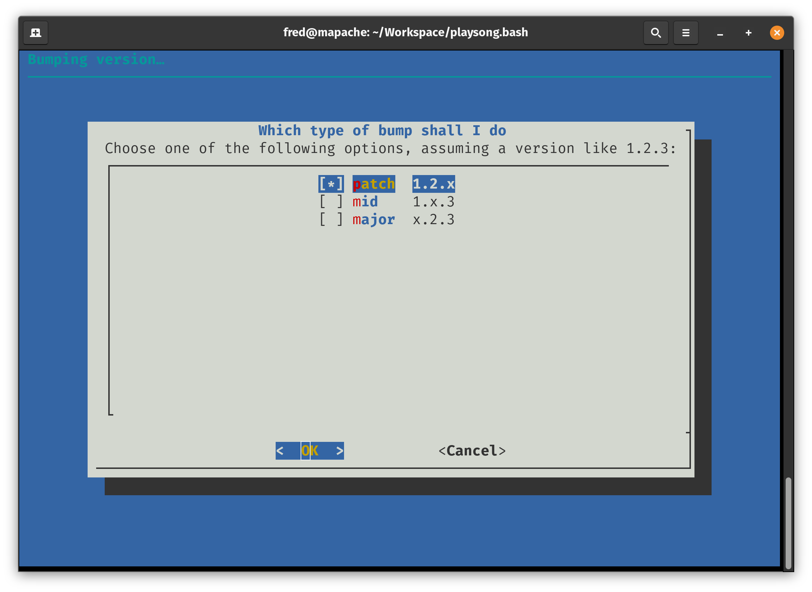
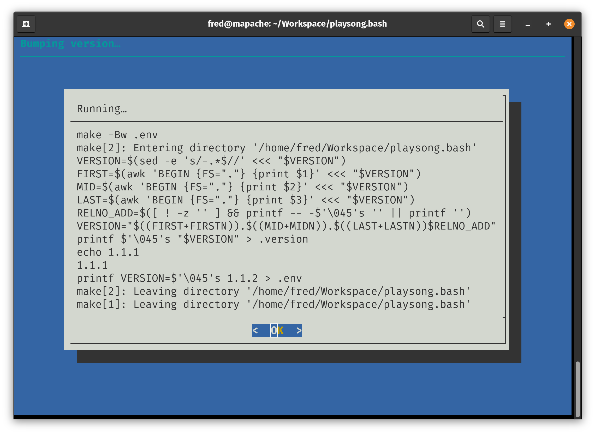
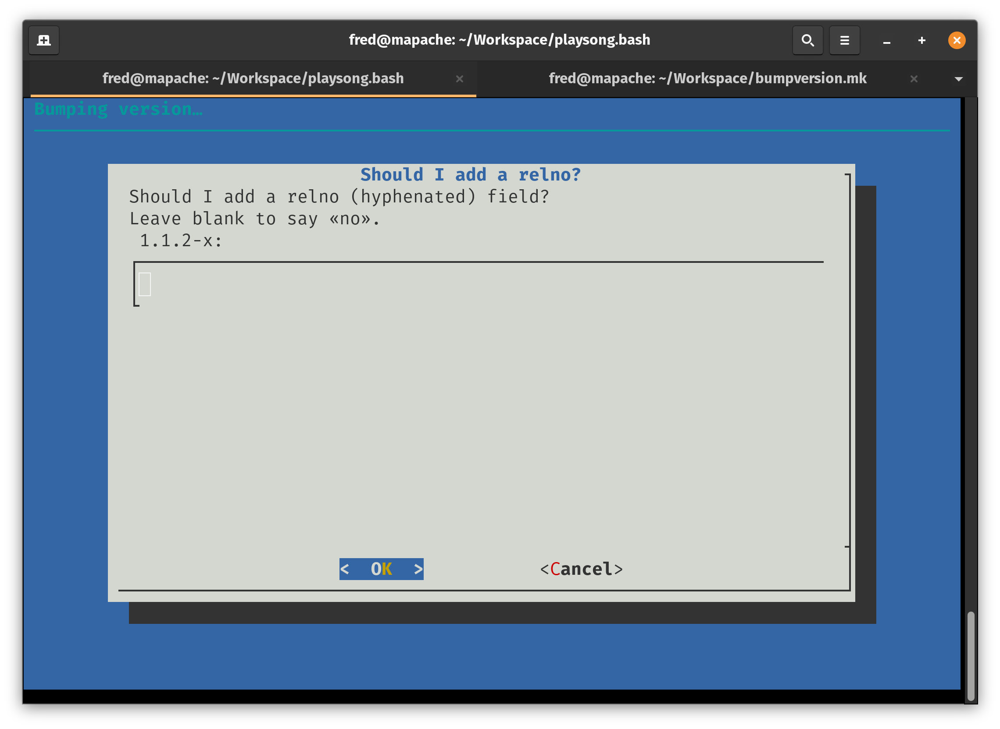
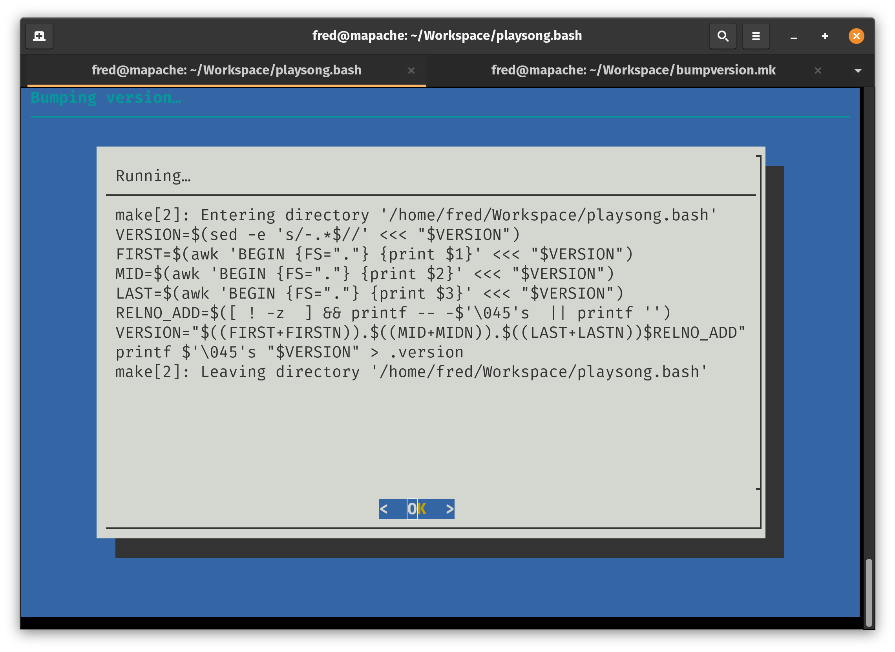

# `make bumpversion` v0.1.2 ⏫20221227

`bumpversion.mk` adds a command called `make bumpversion` (GNU Make
only&dagger;). When run, it gives you a four step flow:

* 
* 
* 
* 

If you don't want to use the GUI or don't have `dialog` command, you may
alternatively run one of:

* `make bumppatchversion`
* `make bumpmidversion`
* `make bumpmajorversion`
* `RELNO=beta1 make bumprelnoversion`

All of these commands have `git_` versions, which by default just print on the
console Git commands to run. If you get used enough to `make bumpversion`, you
can run them with `GITAUTOEXEC=1` in your shell's environment.

<small>&dagger; Also needs GNU bash as its `$SHELL`.</small>

# Results
On first run, a file called .env is created containing:
```bash
VERSION=0.0.1
```

While a file called .version is created containing:
```
0.0.1
```

You'll have to work these into whatever build system you use. :-)

See [playsong.bash](https://github.com/ctrlcctrlv/playsong.bash) for an example
project that uses this.

Also, this README is built with `bumpversion.mk`.

# License
![###############################################################################<br> #🮞🮟🮞🮟🮞🮟🮞🮟🮞🮟🮞🮟`bumpversion.mk`: bumpversion recipe for GNUmakefiles🮞🮟🮞🮟🮞🮟🮞🮟🮞🮟🮞🮟#<br> ###############################################################################<br> # Copyright 2020–2023 ——————— ((((((((((((((Fredrick R. Brennan)))))))))))))) #<br> ###############################################################################<br> # Licensed under the Apache License, Version 2.0 (the "License"); you may not #<br> # use  this  software  or  any of the provided source code  files  except  in #<br> # compliance with the License. You may obtain a copy of the License at:➦ ➦ ➦ ⮯#<br> ###############################################################################<br> #🮞🮟 🮞🮟 🮞🮟 🮞🮟 🮞🮟 🮞🮟 🮞🮟 🮞🮟 🮞🮟 🮞🮟 ➦ <https://www.apache.org/licenses/LICENSE-2.0>#<br> ###############################################################################<br> # Unless  required  by  applicable  law or agreed  to  in  writing,  software #<br> # distributed  under the License is distributed on an "as is" basis,  without #<br> # warranties  or  conditions of any kind, either express or implied. See  the #<br> # License  for  the specific language governing permissions  and  limitations #<br> # under the License. 〜〜〜〜〜〜〜〜〜〜〜〜〜〜〜〜〜〜〜〜〜〜〜〜〜〜〜〜 #<br> ###############################################################################<br> ](docs/LICENSE.png)